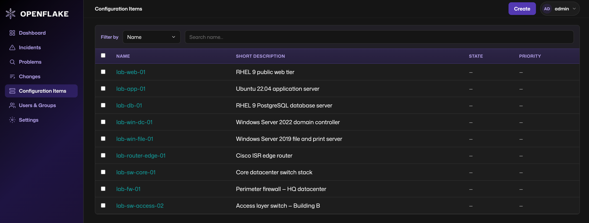

#  OpenFlake

OpenFlake is an open-source, lightweight ITSM platform with a ServiceNow-compatible REST API. It is designed to work with Ansible playbooks using the [servicenow.itsm](https://github.com/ansible-collections/servicenow.itsm) collection.



## Architecture

OpenFlake uses a standard **3-tier architecture** deployed as three containers:

| Tier | Container | Description |
|------|-----------|-------------|
| Presentation | `openflake-frontend` | nginx + React admin UI |
| Application | `openflake-backend` | FastAPI ServiceNow-compatible APIs |
| Data | `openflake-postgres` | PostgreSQL 16 |

## Quick Start (Podman)

```bash
podman compose -f deploy/podman-compose.yaml up -d --build
```

- **UI:** http://localhost:8080
- **API (direct):** http://localhost:8000
- **Default login:** `admin` / `admin`

For production installs from pre-built Quay images with HTTPS, see [docs/installation.md](docs/installation.md).

## Documentation

### Application

[Full documentation](docs/README.md)

| Guide | Description |
|-------|-------------|
| [Installation](docs/installation.md) | Install from Quay, upgrades, publishing images, RHEL sizing |
| [SSL / HTTPS](docs/ssl-https.md) | TLS for Podman, Kubernetes, local dev, and Ansible |
| [Ansible integration](docs/ansible-integration.md) | servicenow.itsm collection setup and examples |
| [API compatibility](docs/api-compatibility.md) | Supported APIs, tables, and Phase 1 limitations |
| [RBAC](docs/rbac.md) | Record ownership, grants, and platform roles |
| [Development](docs/development.md) | Local setup, pre-commit guardrails, lab seed, and tests |
| [Configuration](docs/configuration.md) | Environment variables |
| [Release tagging](docs/release-tagging.md) | Git and Quay image tag strategy |

### Utilities

[Full reference](scripts/README.md)

| Script | Description |
|--------|-------------|
| [podman-install.sh](scripts/docs/podman-install.md) | Install from Quay registry images |
| [podman-upgrade.sh](scripts/docs/podman-upgrade.md) | Pull updates, redeploy, and run DB migrations |
| [podman-update-scripts.sh](scripts/docs/podman-update-scripts.md) | Refresh install helper scripts from GitHub |
| [publish-images.sh](scripts/docs/publish-images.md) | Build and push multi-arch images to Quay |
| [generate-dev-certs.sh](scripts/docs/generate-dev-certs.md) | Generate self-signed TLS certs for local HTTPS |
| [ensure-postgres.sh](scripts/docs/ensure-postgres.md) | Start PostgreSQL in Podman for local dev |
| [start-backend.sh](scripts/docs/start-backend.md) | Run the FastAPI backend with hot reload |
| [stop-backend.sh](scripts/docs/stop-backend.md) | Stop the local uvicorn dev server |

## License

Apache License 2.0
